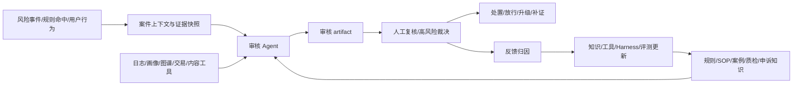

# AI Native 澄清训练卡

## 使用方式

这份训练卡用于补齐面试中容易被追问的底层问题：

```text
AI+ 和 AI Native 到底差在哪？
人机协作里人还做什么？
风控审核领域的 AI Native 终态是什么？
Agent 最后交付什么 artifact？
如何形成数据飞轮？
面试官到底想看什么能力？
```

面试时不要把这些问题分散回答。推荐统一收束到一句话：

> 我理解的 AI Native，不是把 AI 接到旧流程里做提效，而是围绕模型的理解、规划、工具调用、证据组织和反馈学习能力，重新设计业务流程、交付物、人机边界和数据闭环。

## 1. AI+ vs AI Native

| 维度 | AI+ | AI Native |
|---|---|---|
| 核心定义 | 在既有系统和流程上增加 AI 能力 | 以 AI/Agent 能力为核心重新设计产品、流程和组织协作 |
| 改造对象 | 单点功能、页面、问答入口、辅助工具 | 业务链路、决策流程、交付物、反馈闭环和治理体系 |
| AI 角色 | 助手、插件、推荐器、生成器 | 任务执行者、证据组织者、流程编排者、学习闭环参与者 |
| 人的角色 | 原流程操作者，AI 帮人更快完成局部任务 | 目标定义者、边界设定者、风险裁决者、反馈标注者、体系治理者 |
| 典型交付 | 一段回答、一份摘要、一个推荐结果 | 可审计 artifact、结构化决策依据、工具 trace、反馈样本和可迭代知识 |
| 判断标准 | 有没有用 AI | 核心流程是否因 AI 能力被重构，且是否形成持续学习闭环 |

本质区别：

```text
AI+ 是能力叠加。
AI Native 是生产关系重构。
```

在风控审核场景里：

```text
AI+：
在审核后台加一个问答助手，帮审核员查 SOP、总结案件、生成话术。

AI Native：
把风险发现、证据组装、规则对齐、审核研判、案件流转、人工复核、质检申诉和反馈进化重构成一套 Agent 可执行、可约束、可解释、可评估、可进化的审核体系。
```

## 2. 人机协作形态

人机协作不是“人被替代”，而是人的工作从重复查证和经验拼接，转向目标、边界、裁决和治理。

| 环节 | AI / Agent 做什么 | 人做什么 | 人的输入 | 人的输出 |
|---|---|---|---|---|
| 目标定义 | 理解任务目标，拆解执行步骤 | 定义业务目标、成功标准、风险红线 | 审核目标、风险类型、处置原则 | 任务目标、评估标准 |
| 上下文组装 | 检索知识、调用工具、聚合证据 | 确认关键上下文是否足够 | 案件 ID、风险线索、业务约束 | 补充信息、排除噪声 |
| 研判执行 | 对齐规则、组织证据、生成建议 | 审核高风险、低置信、规则冲突 case | 规则、SOP、案例、工具结果 | 采纳、修正、驳回、升级 |
| 交付确认 | 生成证据链、建议动作和待确认项 | 对高影响动作负责最终裁决 | Agent artifact、置信度、风险提示 | 最终判定、处置动作、复核意见 |
| 体系进化 | 生成候选知识、候选策略、评测样本 | 审核候选更新，决定是否灰度发布 | 反馈样本、失败 trace、归因结果 | 知识更新、边界更新、评测集更新 |

人的边界：

```text
人不应该继续承担所有低价值查证劳动。
人必须保留目标定义、价值判断、风险裁决、高影响动作确认和体系治理权。
```

面试表达：

> 我不会把 Agent 设计成完全替代审核员。更合理的形态是：Agent 承担证据收集、规则对齐、初步研判和结构化交付；人负责目标设定、高风险裁决、异常纠偏和反馈治理。这样既能提效，也能保证责任边界清晰。

## 3. 风控审核领域的 AI Native 终态

风控审核领域的 AI Native 终态不是“全自动处罚用户”，而是一套可控的智能审核操作系统。



终态特征：

```text
1. 风险发现从规则命中为主，走向规则、模型、Agent 和人工反馈协同发现。
2. 审核研判从个人经验驱动，走向证据驱动、规则对齐、置信度分层。
3. 案件流转从固定工单流，走向基于风险等级、证据充分性和权限边界动态编排。
4. 知识沉淀从文档和人脑，走向规则、案例、反例、质检和申诉反馈结构化治理。
5. 体系进化从人工复盘后手动改规则，走向候选生成、人工审核、灰度验证、效果监控和可回滚发布。
```

一句话：

> 终态不是让模型替代风控系统，而是让 Agent 成为风控审核域里的证据组织层、研判协同层和反馈进化层，上游尊重实时规则引擎，下游服务人工裁决和体系迭代。

## 4. AI 交付什么：Artifact

Artifact 是 AI 完成任务后交付给人和系统的结构化工作产物，不只是自然语言回答。

在风控审核中，Agent 的核心 artifact 应该包括：

```text
风险类型：
当前案件属于哪类风险。

证据链：
引用了哪些日志、规则、用户行为、历史案例和工具结果。

规则依据：
命中了哪些规则、SOP 或审核标准。

建议动作：
放行、拦截、降权、补证、升级复核或继续观察。

置信度与风险等级：
说明模型对判断的把握程度和业务影响级别。

待人工确认项：
哪些事实不充分、哪些规则冲突、哪些动作不能自动执行。

执行 trace：
Agent 调用了哪些工具、参数是什么、中间结果是什么。

反馈入口：
人工可以采纳、修正、驳回、标注原因，并进入后续归因。
```

交互方式：

```text
不是只给一段结论，而是给一个可检查、可追问、可修改、可提交反馈的审核工作台。
```

面试表达：

> 我更关注 Agent 交付的不是一句“建议拦截”，而是一份可审计 artifact：风险类型、证据链、规则依据、建议动作、置信度、待人工确认项和 trace。人可以基于这份 artifact 做最终裁决，裁决结果又能进入反馈归因。

## 5. 数据飞轮怎么形成

数据飞轮不是把线上数据无脑喂回模型，而是把每次执行、复核和失败都转化为可治理资产。

```text
Agent 执行
→ 产生 artifact 和 trace
→ 人工复核 / 质检 / 申诉
→ 形成结构化反馈
→ 归因到知识、上下文、工具、Harness、流程或评测问题
→ 生成候选更新
→ 人工审核和灰度验证
→ 更新知识库、工具能力、Prompt / Workflow、Harness 边界和评测集
→ 下一轮审核质量提升
```

关键原则：

```text
反馈先归因，再更新。
候选先审核，再发布。
上线先灰度，再扩大。
所有变更可追溯、可评估、可回滚。
```

飞轮的价值：

```text
短期：
减少重复查证，提高证据链生成效率。

中期：
统一审核口径，降低误判、漏判和申诉推翻率。

长期：
新风险样本更快沉淀到知识、工具、边界和评测体系，形成可持续进化能力。
```

## 6. 要体现的能力

面试官不是只看你会不会说 Agent 概念，而是看你有没有从业务、工程和治理三层把事情落地。

| 能力 | 面试官想看什么 | 你应该怎么体现 |
|---|---|---|
| 宏观认知 | 能区分 AI+ 和 AI Native，知道 AI 改的是业务形态而不是页面功能 | 从领域终态、业务链路重构、人机边界和数据飞轮讲起 |
| 工程落地 | 不是停留在概念，能讲清系统怎么跑 | 讲知识治理、上下文组装、Tool Calling、Workflow、Harness、Trace、Eval |
| 风险治理 | 知道哪些不能自动化，知道如何审计和回滚 | 强调人工复核、权限边界、证据链、灰度、版本和评测 |
| 业务价值 | 能把技术能力转成业务指标 | 短期提效、中期提质、长期进化 |
| 个人可信度 | 能说明自己负责的范围，不虚构全量 ownership | 用“方向架构 / 关键链路 / 闭环验证”三层讲贡献 |

自检问题：

```text
我能不能用 30 秒讲清 AI Native 不是 AI+？
我能不能画出一次审核 artifact 的结构？
我能不能解释人为什么仍然关键？
我能不能说明反馈如何进入受控飞轮，而不是污染系统？
我能不能把项目价值讲成指标，而不是“用了 AI 很先进”？
```

## 7. 叙事方法

推荐主叙事：

```text
出发点：
传统风控审核的核心矛盾不是单点效率，而是知识、流程、工具、权限和反馈割裂。

怎么拆：
按五条主线拆业务域，按三大支柱搭能力底座，再按单次执行闭环和长期进化闭环落地。

成功案例：
以一次高风险案件审核为例，展示 Agent 如何组装上下文、调用工具、对齐规则、输出 artifact，并进入人工复核。

价值结果：
短期提效，中期提质，长期形成数据飞轮和体系进化能力。
```

宏观到细化：

```text
Why：
为什么要从 AI+ 走向 AI Native。

What：
AI Native 风控审核终态是什么。

How：
知识治理、上下文、工具、Workflow、Harness、Artifact、Trace、Eval、Feedback 如何支撑。

Proof：
用指标、trace、评测集、灰度和回滚证明可上线。
```

## 8. 不同岗位差异化讲法

| 岗位 | 重点讲法 | 不要过度展开 |
|---|---|---|
| Java 后端 / AI 应用开发 | Spring Boot / Spring AI、Tool Calling、MCP、权限、审计、Trace、Eval、业务系统集成 | 不要只讲模型参数和 Prompt |
| Agent 平台工程 | Orchestrator、工具注册、状态管理、Harness、评测回归、多租户和治理 | 不要陷入单一业务 case |
| 业务系统 / 中台开发 | 如何把规则、流程、工单、知识库和审核系统 Agent 化 | 不要把 Agent 讲成独立玩具 |
| 产品 / 解决方案 | AI Native 终态、人机边界、artifact 交付、数据飞轮和业务价值 | 不要堆框架名 |
| 风控 / 安全相关岗位 | 规则引擎关系、证据链、人工复核、误判漏判、申诉和审计 | 不要暗示全自动高影响处置 |

## 9. 30 秒答法

> 我会先区分 AI+ 和 AI Native。AI+ 是在旧流程上叠加 AI，比如加一个审核问答助手；AI Native 是围绕 Agent 的理解、工具调用、证据组织和反馈学习能力重构业务链路。放在风控审核里，目标不是让模型自动处罚用户，而是让 Agent 在规则、工具和 Harness 约束下生成可审计的审核 artifact，包括风险类型、证据链、规则依据、建议动作、置信度和待人工确认项。人负责高风险裁决和反馈治理，反馈再经过归因、人工审核、灰度和回滚进入知识、工具、边界和评测更新，形成受控数据飞轮。

